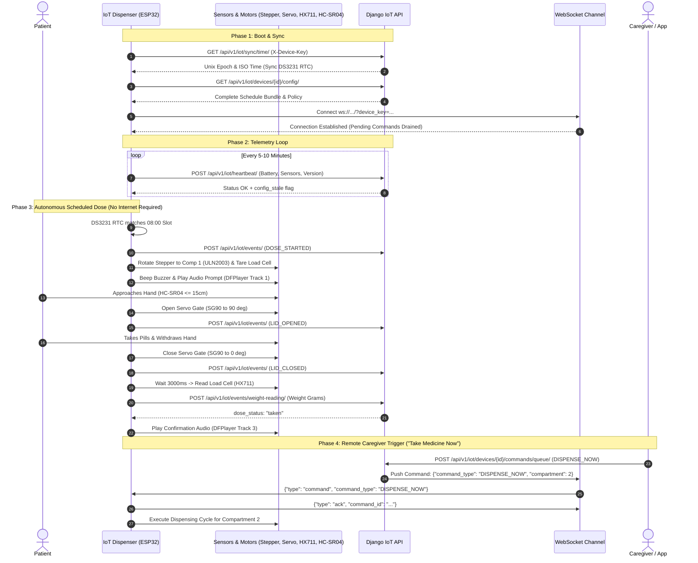

# Aarogyam / MedAdhere — IoT Smart Pill Dispenser API Documentation

## 1. System & Architecture Overview

The **Aarogyam / MedAdhere IoT Smart Pill Dispenser** is an autonomous, sensor-verified circular 4-compartment medication dispenser powered by an ESP32 microcontroller (or Arduino-compatible architecture). It operates in both **fully autonomous offline mode** (using an onboard DS3231 RTC and local NVS flash memory) and **cloud-synchronized online mode** via HTTP REST and real-time WebSockets.

### 1.1 Hardware Components & Pinout Mapping

| Component | Interface / Pins | Physical Function |
|---|---|---|
| **Stepper Motor (28BYJ-48 + ULN2003)** | GPIO 13, 14, 27, 26 (or 13, 12, 14, 27) | Rotates carousel (1024 half-steps = 90° per compartment). |
| **Servo Gate (SG90 / MG90S)** | GPIO 25 (PWM) | Opens (90°) and closes (0°) the medication slot access lid. |
| **Ultrasonic Sensor (HC-SR04)** | Trig: GPIO 19/26, Echo: GPIO 18/33 | Proximity detection (<= 15 cm) for patient hand retrieval. |
| **Load Cell (1 kg + HX711)** | DOUT: GPIO 35, SCK: GPIO 18 | Micro-gram level weight verification before and after dispensing. |
| **Real-Time Clock (DS3231)** | I2C (SDA: 21/23, SCL: 22) @ `0x68` | Offline scheduling, drift-resistant timekeeping. |
| **Display (SSD1306 OLED 128x64)** | I2C (SDA: 21, SCL: 22) @ `0x3C` | Displays medication name, dosage, instructions, and clock. |
| **Audio Speaker (DFPlayer Mini MP3)** | UART2 (TX: GPIO 17, RX: GPIO 16) | Voice guidance and audio alarm prompts in local languages. |
| **Hall Effect / Limit Sensor** | GPIO 33 | Homing and calibration for compartment 1 index. |
| **Buzzer & Indicator LED** | Buzzer: GPIO 32, LED: GPIO 2 | Auditory and visual chime for dose alerts and status. |

---

## 2. Authentication & Security

All communications between the IoT device and the cloud backend are strictly authenticated.

### 2.1 HTTP REST Authentication
Every HTTP request originating from the IoT device must include the device's provisioned API key in the custom header:
```http
X-Device-Key: <DEVICE_API_KEY>
```
* Backend Validator: `DeviceAPIKeyAuthentication` in `apps/iot/authentication.py`.
* Unauthorized attempts return `401 Unauthorized` (`{"status": "error", "message": "Missing or invalid X-Device-Key header"}`).

### 2.2 WebSocket Channel Authentication
Since standard ESP32 WebSocket client implementations cannot inject custom headers during the HTTP upgrade handshake, the API key is passed as a URL query parameter:
```http
ws://<BACKEND_HOST>:<PORT>/ws/iot/device/<DEVICE_ID>/?device_key=<DEVICE_API_KEY>
```
* Backend Validator: `DeviceKeyAuthMiddleware` in `apps/iot/ws_auth.py`.
* If the API key does not match the UUID in the route, the connection is closed with status code `4003`.

---

## 3. Core Device Firmware APIs (Directly Called by the Device)

### 3.1 Device Configuration & Schedule Bundle
* **Method & URL**: `GET /api/v1/iot/devices/{device_id}/config/`
* **Authentication**: `X-Device-Key` (or JWT for device owner debugging)
* **Purpose**: Fetches the device's complete world state: scheduled slots, alarm times in device-local wall clock (IST), active medications, expected weight reductions, audio track mappings, and operational policies.
* **Firmware Flow**: Called upon boot and whenever a heartbeat flags `config_stale = true`. The device saves this to NVS memory and drives its own RTC schedule.

#### Response Example (`200 OK`):
```json
{
  "status": "success",
  "data": {
    "schedule_version": 4,
    "device_id": "e214a30b-c919-4d23-b3f1-80557b756cdd",
    "timezone": "Asia/Kolkata",
    "utc_offset_minutes": 330,
    "server_unix_time": 1789504200,
    "server_time_local": "2026-09-16T08:00:00+05:30",
    "total_weight_grams": 142.50,
    "tare_weight_grams": 45.20,
    "is_gate_locked": false,
    "policy": {
      "dose_window_minutes": 60,
      "catchup_window_minutes": 30,
      "max_gate_opens": 4,
      "weight_settle_ms": 3000,
      "hand_detect_cm": 15,
      "heartbeat_interval_seconds": 600,
      "command_poll_seconds": 300
    },
    "compartments": [
      {
        "compartment_number": 1,
        "time_slot": "morning_before",
        "time": "08:00",
        "enabled": true,
        "content_weight_grams": 35.50,
        "expected_dose_reduction_grams": 1.25,
        "display_text": "Paracetamol 500mg\n1 Tab (Before Food)",
        "voice_text": "Dawai lene ka waqt ho gaya hai. Kripya Paracetamol lijiye.",
        "audio_track": 1,
        "medicines": [
          {
            "medicine_uuid": "3fa85f64-5717-4562-b3fc-2c963f66afa6",
            "name": "Paracetamol",
            "pill_weight_grams": 0.625,
            "qty_per_dose": 2
          }
        ]
      },
      {
        "compartment_number": 2,
        "time_slot": "morning_after",
        "time": "09:00",
        "enabled": true,
        "content_weight_grams": 40.00,
        "expected_dose_reduction_grams": 0.50,
        "display_text": "Vitamin C\n1 Tab (After Food)",
        "voice_text": "Khane ke baad ki dawai: Vitamin C lijiye.",
        "audio_track": 1,
        "medicines": [
          {
            "medicine_uuid": "c39a5f78-2941-4c31-9f93-19b183617192",
            "name": "Vitamin C",
            "pill_weight_grams": 0.50,
            "qty_per_dose": 1
          }
        ]
      }
    ]
  }
}
```

---

### 3.2 Real-Time Clock Synchronization
* **Method & URL**: `GET /api/v1/iot/sync/time/`
* **Authentication**: `X-Device-Key`
* **Purpose**: Provides UTC and ISO timestamps for setting or calibrating the onboard DS3231 RTC hardware register.
* **Firmware Flow**: Called during device boot or when `rtc_drift_seconds` reported in a heartbeat exceeds threshold.

#### Response Example (`200 OK`):
```json
{
  "status": "success",
  "data": {
    "unix_timestamp": 1789504215,
    "iso_time": "2026-09-15T20:30:15.123456Z",
    "utc_offset_seconds": 0
  }
}
```

---

### 3.3 Device Health Telemetry (Heartbeat)
* **Method & URL**: `POST /api/v1/iot/heartbeat/`
* **Authentication**: `X-Device-Key`
* **Interval**: Every 300,000 ms – 600,000 ms (5–10 minutes)
* **Purpose**:
  1. Updates the `last_seen_at` timestamp.
  2. Records hardware telemetry: battery level, stepper motor status, servo status, ultrasonic sensor status, and WiFi RSSI.
  3. Detects RTC clock drift between device and server.
  4. Triggers emergency battery alerts via `IoTAgent` when battery is `< 15%`.
  5. Performs **Config Reconciliation**: flags `config_stale = true` if schedule changes occurred server-side.

#### Request Example:
```json
{
  "device_id": "e214a30b-c919-4d23-b3f1-80557b756cdd",
  "battery_level": 92,
  "firmware_version": "3.2.0-ino",
  "wifi_strength": -58,
  "uptime_seconds": 86400,
  "stepper_status": "ok",
  "servo_status": "ok",
  "ultrasonic_status": "ok",
  "rtc_time": "2026-09-16T08:00:00",
  "schedule_version": 3
}
```

#### Response Example (`200 OK`):
```json
{
  "status": "success",
  "data": {
    "server_time": "2026-09-16T02:30:00Z",
    "server_unix_time": 1789504200,
    "schedule_version": 4,
    "config_stale": true,
    "pending_commands": 0,
    "gate_locked": false,
    "rtc_drift_seconds": 1,
    "firmware_update_available": false
  }
}
```

---

### 3.4 Live Event Ingestion
* **Method & URL**: `POST /api/v1/iot/events/`
* **Authentication**: `X-Device-Key`
* **Purpose**: Ingests state transitions, dispensing checkpoints, and hardware interactions. Handles idempotent deduplication via `event_uuid`.
* **Side Effects**: Automatically updates remaining pill counts in inventory, marks dose sessions, and broadcasts to the Agent Orchestrator.

#### Request Payload Schema:
```json
{
  "event_uuid": "550e8400-e29b-41d4-a716-446655440000",
  "event_type": "DOSE_TAKEN",
  "compartment": 1,
  "compartment_num": 1,
  "medicine": "Paracetamol",
  "dose": 1,
  "occurred_at": "2026-09-16T08:02:15+05:30",
  "device_id": "e214a30b-c919-4d23-b3f1-80557b756cdd",
  "firmware_version": "3.2.0-ino",
  "session_uuid": "b0f71946-4cb4-4a49-9c59-bf75c74239fa"
}
```

#### Response Example (`200 OK` / `201 Created`):
```json
{
  "status": "success",
  "data": {
    "status": "accepted",
    "adherence_event_id": "9a6e1189-9821-4f81-9b63-07bf653068e1"
  }
}
```
*(If the event was already received and processed, returns `{"status": "success", "data": {"status": "duplicate_ignored"}}`)*.

---

### 3.5 Offline Event Queue Batch Flush
* **Method & URL**: `POST /api/v1/iot/events/batch/`
* **Authentication**: `X-Device-Key`
* **Purpose**: Flushes events that were saved to NVS flash storage during network disconnection.
* **Batch Limit**: Maximum 50 events per batch.
* **Integrity Guarantee**: Each event retains the RTC wall clock timestamp (`occurred_at`) recorded when the physical action took place.

#### Request Example:
```json
{
  "events": [
    {
      "event_uuid": "1b9d6bcd-bbfd-4b2d-9b5d-ab8dfbbd4bed",
      "event_type": "DOSE_STARTED",
      "compartment_num": 1,
      "occurred_at": "2026-09-16T08:00:02+05:30",
      "session_uuid": "a7b3c2d1-e5f6-4a8b-9c0d-1e2f3a4b5c6d"
    },
    {
      "event_uuid": "550e8400-e29b-41d4-a716-446655440000",
      "event_type": "DOSE_TAKEN",
      "compartment_num": 1,
      "occurred_at": "2026-09-16T08:01:45+05:30",
      "session_uuid": "a7b3c2d1-e5f6-4a8b-9c0d-1e2f3a4b5c6d"
    }
  ]
}
```

#### Response Example (`200 OK`):
```json
{
  "status": "success",
  "data": {
    "received": 2,
    "accepted": 2,
    "results": [
      {
        "event_uuid": "1b9d6bcd-bbfd-4b2d-9b5d-ab8dfbbd4bed",
        "event_type": "DOSE_STARTED",
        "status": "accepted"
      },
      {
        "event_uuid": "550e8400-e29b-41d4-a716-446655440000",
        "event_type": "DOSE_TAKEN",
        "status": "accepted"
      }
    ]
  }
}
```

---

### 3.6 Remote Command Polling (HTTP Fallback)
* **Method & URL**: `GET /api/v1/iot/devices/{device_id}/commands/`
* **Authentication**: `X-Device-Key` (or JWT for owner)
* **Polling Interval**: Every 15–30 seconds (or safety net fallback)
* **Purpose**: Retrieves all pending commands queued by caregivers or clinical operators. Returns commands sorted with `HIGH` priority commands (e.g. emergency dispense) first.
* **Side Effect**: Retrieved commands automatically transition from `PENDING` to `SENT`.

#### Response Example (`200 OK`):
```json
{
  "status": "success",
  "data": {
    "commands": [
      {
        "command_id": "f5e4d3c2-b1a0-4987-9876-543210fedcba",
        "type": "DISPENSE_NOW",
        "payload": {
          "compartment": 2,
          "priority": "HIGH"
        }
      }
    ]
  }
}
```

---

### 3.7 Current Dispenser Schedule & Immediate Dose Evaluation
* **Method & URL**: `GET /api/v1/iot/devices/{device_id}/dispenser/schedule/current/`
* **Authentication**: `X-Device-Key`
* **Purpose**: Queries the backend to determine if any dose must be dispensed right now.
  * Evaluates Priority 1: Manual triggers initiated within the last 30 minutes.
  * Evaluates Priority 2: Current IST wall clock against scheduled ±10-minute slot windows.
* **Returns**: Display text for OLED, voice guidance for DFPlayer, expected tare weights, and active dose session UUID.

#### Response Example (`200 OK`):
```json
{
  "status": "success",
  "data": {
    "active": true,
    "has_dose": true,
    "compartment_number": 2,
    "time_slot": "morning_after",
    "voice_text": "Khane ke baad ki dawai: Vitamin C lijiye.",
    "display_text": "Slot 2: Morning After\nVitamin C (1 pill)",
    "expected_weight_before": 85.40,
    "gate_open_count": 0,
    "gate_locked": false,
    "session_id": "b0f71946-4cb4-4a49-9c59-bf75c74239fa",
    "server_time": "2026-09-16T09:02:00+05:30",
    "trigger": "scheduled"
  }
}
```

---

### 3.8 Load Cell Weight Reading Verification
* **Method & URL**: `POST /api/v1/iot/events/weight-reading/`
* **Authentication**: `X-Device-Key`
* **Purpose**: Firmware transmits the raw weight read by the HX711 sensor after the lid closes.
* **Business Logic**:
  * Calculates difference: $\Delta W = W_{\text{before}} - W_{\text{after}}$.
  * Compares $\Delta W$ against expected dose reduction:
    * **Full Dose**: $\Delta W \approx W_{\text{expected}} \rightarrow \text{dose\_status} = \text{"taken"}$.
    * **Partial Dose**: $0 < \Delta W < W_{\text{expected}} \rightarrow \text{dose\_status} = \text{"partial"}$.
    * **Missed**: $\Delta W \approx 0 \rightarrow \text{dose\_status} = \text{"missed"}$ (triggers caregiver alert).

#### Request Example:
```json
{
  "compartment_number": 2,
  "weight_grams": 84.15,
  "session_uuid": "b0f71946-4cb4-4a49-9c59-bf75c74239fa",
  "occurred_at": "2026-09-16T09:03:10+05:30"
}
```

#### Response Example (`200 OK`):
```json
{
  "status": "success",
  "data": {
    "dose_status": "taken",
    "actual_reduction_grams": 1.25,
    "expected_reduction_grams": 1.25,
    "is_valid": true,
    "gate_locked": false,
    "message": "Dose verified: taken"
  }
}
```

---

### 3.9 Guided Pill Refill Measurement
* **Method & URL**: `POST /api/v1/iot/devices/{device_id}/fill/measure/`
* **Authentication**: `X-Device-Key`
* **Purpose**: Used during refill mode. As pills for a medicine are placed into a compartment, the load cell reads the weight of the entire carousel.
* **Calculation**:
  $$\text{added\_weight} = \text{total\_weight\_grams} - \text{previous\_device\_weight}$$
  $$\text{pill\_weight} = \frac{\text{added\_weight}}{\text{total\_pills\_registered}}$$
* **Effect**: Automatically calibrates and sets the physical weight profile for that medication in `SubCompartment`.

#### Request Example:
```json
{
  "compartment_number": 1,
  "total_weight_grams": 145.8,
  "medicine_id": "3fa85f64-5717-4562-b3fc-2c963f66afa6"
}
```

#### Response Example (`200 OK`):
```json
{
  "status": "success",
  "data": {
    "compartment_number": 1,
    "medicine_name": "Paracetamol",
    "derived_weight_grams": 25.40,
    "pill_weight_grams": 0.8467,
    "schedule_version": 5,
    "message": "Fill measurement registered."
  }
}
```

---

### 3.10 Gate Tamper & Activity Reporting
* **Method & URL**: `POST /api/v1/iot/events/gate-event/`
* **Authentication**: `X-Device-Key`
* **Purpose**: Reports whenever the servo gate opens or closes.
* **Anti-Tamper Logic**: Increments `gate_open_count`. If opened more than `MAX_GATE_OPENS` (e.g. 4 times) within a single session without valid pill removal, locks the dispenser and notifies the caregiver.

#### Request Example:
```json
{
  "compartment_number": 1,
  "event_type": "open"
}
```

#### Response Example (`200 OK`):
```json
{
  "status": "success",
  "data": {
    "gate_locked": false,
    "gate_open_count": 1,
    "command": null
  }
}
```

---

## 4. Real-Time WebSocket Channel

* **Endpoint**: `ws://<BACKEND_HOST>:<PORT>/ws/iot/device/<DEVICE_ID>/?device_key=<DEVICE_API_KEY>`
* **Protocol**: JSON text frames over WebSocket (RFC 6455)
* **Keep-Alive**: Ping every 30s, Pong timeout within 10s.

### 4.1 Client-to-Server Messages

#### 1. Ping Frame:
```json
{
  "type": "ping"
}
```

#### 2. Command Acknowledgment:
```json
{
  "type": "ack",
  "command_id": "f5e4d3c2-b1a0-4987-9876-543210fedcba"
}
```

---

### 4.2 Server-to-Client Messages

#### 1. Pong Frame (includes server time for clock sync check):
```json
{
  "type": "pong",
  "server_unix_time": 1789504220
}
```

#### 2. Real-Time Command Push:
```json
{
  "type": "command",
  "command_id": "f5e4d3c2-b1a0-4987-9876-543210fedcba",
  "command_type": "DISPENSE_NOW",
  "payload": {
    "compartment": 1,
    "priority": "HIGH"
  }
}
```

---

## 5. Event Catalog Emitted by the IoT Device

All events emitted to `/api/v1/iot/events/` or batch-uploaded to `/api/v1/iot/events/batch/`:

| Event Name | Trigger Condition | Associated Payload Fields | Backend Action |
|---|---|---|---|
| `DEVICE_BOOT` | Device boot or hardware reset. | `battery_level`, `firmware_version`, `stepper_status` | Returns daily schedule, updates device online status. |
| `DOSE_STARTED` | Slot time reached or remote dispense triggered. | `compartment_num`, `session_uuid`, `weight_before` | Creates pending `DoseSession`, sets baseline weight tare. |
| `COMPARTMENT_ROTATED` | Stepper finished rotating to target slot. | `compartment_num` | Logs motor telemetry, updates current compartment. |
| `HAND_DETECTED` | Ultrasonic sensor detected object <= 15cm. | `compartment_num`, `session_uuid` | Prepares lid opening, logs patient approach. |
| `LID_OPENED` | Servo moved to 90° open position. | `compartment_num`, `session_uuid` | Increments lid open counter, starts withdrawal timer. |
| `LID_CLOSED` | Servo moved to 0° closed position. | `compartment_num`, `session_uuid` | Starts weight stabilization delay (3 seconds). |
| `WEIGHT_READING` | Settled load cell measurement. | `compartment_num`, `weight_grams`, `session_uuid` | Performs adherence math, marks dose taken/partial. |
| `DOSE_TAKEN` | Dose retrieval confirmed. | `compartment_num`, `medicine`, `dose` | Decrements pill count in inventory, notifies caregiver. |
| `DOSE_MISSED` / `DOSE_TIMEOUT` | Dispense window elapsed without intake. | `compartment_num`, `session_uuid` | Triggers caregiver escalation alerts via Twilio/FCM. |
| `DOSE_SKIPPED` | Patient explicitly selected skip on device. | `compartment_num`, `session_uuid` | Records non-adherence event with reason `SKIPPED`. |
| `LOW_BATTERY` | Battery level dropped below 15%. | `battery_level` | Sends push notification to caregiver for battery recharge. |
| `COMMAND_ACKNOWLEDGED` | Hardware finished command execution. | `command_id` | Marks command `ACKNOWLEDGED` in database. |
| `DOSE_DUPLICATE_BLOCKED` | Attempted second dispense in same window. | `compartment_num` | Logs safety anti-double-dose intervention. |

---

## 6. Remote Commands Received by the IoT Device

Dispatched via WebSocket (or collected via HTTP polling):

| Command Identifier | Payload Parameters | Physical Action on Dispenser Hardware |
|---|---|---|
| `DISPENSE_NOW` / `TRIGGER_DOSE` | `{"compartment": 1}` | Rotates to target compartment, triggers buzzer, plays audio reminder, opens lid upon ultrasonic hand detection. |
| `START_FILL_MODE` | `{"compartment": 1, "medication_name": "Aspirin"}` | Enters refill mode. Rotates carousel to compartment 1, opens lid, displays medicine name on OLED. |
| `NEXT_COMPARTMENT` | `{"compartment": 2, "medication_name": "Calcium"}` | Closes lid, pauses 500ms, rotates stepper to compartment 2, reopens lid. |
| `END_FILL_MODE` | `{"message": "Fill Complete"}` | Closes servo lid, sounds completion chime, returns to idle scheduling state. |
| `READ_FILL_WEIGHT` | `{"medicine_id": "<uuid>", "compartment_number": 1}` | Waits 3s for settling, reads HX711 scale, posts reading to `/api/v1/iot/events/fill-weight/`. |
| `GATE_LOCK` | `{}` | Closes lid immediately, sets locked flag, plays audio alert (`AUDIO_DOSE_MISSED`). |
| `GATE_UNLOCK` | `{}` | Clears locked flag, plays unlock prompt (`AUDIO_CAREGIVER_UNLOCK`), enables normal access. |
| `SYNC_CONFIG` / `SYNC_SCHEDULE` | `{}` | Triggers immediate HTTP fetch of `/api/v1/iot/devices/{id}/config/`. |
| `SYNC_TIME` | `{}` | Fetches `/api/v1/iot/sync/time/` and recalibrates DS3231 RTC registers. |
| `RESET_FLAGS` | `{}` | Clears today's dispensed flags in flash memory for daily rollover testing. |

---

## 7. Companion Caregiver & Mobile App Management APIs

*(Authenticated via JWT: `Authorization: Bearer <ACCESS_TOKEN>`)*

| Method | Endpoint | Description |
|---|---|---|
| `POST` | `/api/v1/iot/devices/validate-code/` | Validates device unique pairing code (e.g. `MED-1234`) before provisioning. |
| `POST` | `/api/v1/iot/devices/link/` | Links validated hardware to user account. |
| `POST` | `/api/v1/iot/devices/<pk>/link-patient/` | Links hardware dispenser to a specific patient profile. |
| `POST` | `/api/v1/iot/devices/<pk>/dispenser/setup/` | Provisions 4 physical compartments with initial slot times. |
| `PATCH`| `/api/v1/iot/devices/<pk>/dispenser/compartments/<num>/time/` | Updates alarm time (`HH:MM`) for any slot; bumps `schedule_version`. |
| `POST` | `/api/v1/iot/devices/<pk>/dispenser/compartments/<num>/medicine/add/` | Adds a medicine to a compartment. |
| `POST` | `/api/v1/iot/devices/<pk>/dispenser/compartments/<num>/medicines/<id>/measure-weight/` | Queues `READ_FILL_WEIGHT` command for the dispenser. |
| `POST` | `/api/v1/iot/devices/<pk>/dispenser/fill/complete/` | Confirms all compartments are stocked, locks expected weights, exits fill mode. |
| `POST` | `/api/v1/iot/devices/<pk>/commands/queue/` | Queues arbitrary commands (`DISPENSE_NOW`, `GATE_LOCK`, etc.). |
| `POST` | `/api/v1/iot/dose/caregiver-unlock/` | Remotely unlocks dispenser after missed dose or security lockout. |
| `GET`  | `/api/v1/iot/dose/history/?device_id=<uuid>` | Retrieves adherence history recorded by dispenser sensors. |
| `GET`  | `/api/v1/iot/dose/alerts/` | Retrieves missed dose, partial dose, and tampering alerts. |

---

## 8. Complete System Architecture & Data Flow


